# Linux常用基础命令

## 1 学习目标

- 说出Linux下的目录结构和常见目录的作用
- 熟练使用Linux下的相对路径和绝对路径
- 熟练使用Linux下常用文件和目录操作相关的命令
- 熟练使用修改用户权限、用户和用户组相关的命令
- 熟练使用文件的查找和检索相关的命令
- 熟练掌握Ubuntu下的软件安装和卸载
- 熟练使用压缩工具完成文件或目录的压缩解压缩

## 2 命令解析器

- shell 就是命令解释器
- 命令解析器的作用：对用户输入到终端的命令进行解析，调用对应的执行程序。

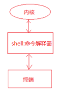

用户在终端输入命令, 由shell命令解释器对命令进行解析(按照$PATH环境变量搜索命令), 解析成内核能够识别的指令, 然后由内核执行命令, 最后由终端显示命令执行的结果给用户.

> 注意：shell在寻找命令的时候是按照$PATH环境变量去查找的，如果找到了就执行对应的命令，若找不到就报错, 执行echo $PATH可以查看PATH环境变量的值.

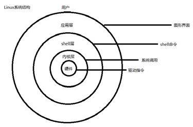

- 常用的命令解析器：

  - shell -- Bourne Shell
    - /bin/sh

  - bash -- Bourne Again Shell
    - /bin/bash

- 当前系统所使用的shell

  - echo $SHELL

- 当前系统下有哪些shell

  - cat /etc/shells

## 3      Linux下常用快捷键

### 3.1 tab键的作用

- 补齐命令

​        如：在终端输入`his`然后按tab键，会补齐`history`命令;

​        如：输入`l`然后按`tab`键, 会显示所有以`l`开头的命令.

- 补齐文件(包括目录和文件)

​       例如：如果在执行ls, 然后按tab键, 会显示当前目录下所有的文件

​      使用tab键的优点: 减少用户输入, 加快输入速度, 减少出错的机会。

### 3.2 主键盘快捷键

- 遍历输入的历史命令

  - 从当前位置向上遍历：ctrl + p（**↑**）

  - 从当前位置向下遍历：ctrl + n（**↓**）

>  注意：使用history命令可以显示用户输入的所有命令。

- 光标位置移动

  - 光标左移： ctrl + b （方向键上）

  - 坐标右移： ctrl + f （方向键下）

  - 移动到头部： ctrl + a（**home**）

  - 移动到尾部： ctlr + e（**end**）

- 字符删除

  - 删除光标前边的字符：ctrl + h（Backspace）

  - 删除光标后边的字符：ctrl + d

    - 光标后边的字符即光标覆盖的字符

    -  ，执行该命令，删除的是字符W

  - 删除光标前所有内容：ctrl + u

  - 删除光标后所有内容：ctrl + k

## 4      linux下的目录结构

### 4.1 linux系统的目录结构

- Linux系统的目录结构是一个倒立的树状结构, 根目录用/表示，对比windows目录结构理解linux的目录结构。

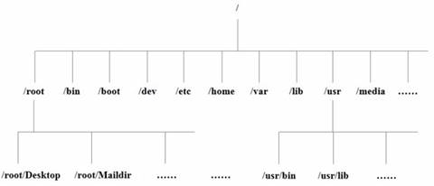


### 4.2  linux下主要目录介绍

-  /bin: binary，二进制文件，可执行程序，shell命令
  -  如: ls , rm , mv, cp等常用命令

- /sbin: s是Super User的意思，这里存放的是系统管理员使用的系统管理程序。
  - 如ifconfig, halt, shutdown, reboot等系统命令

- /dev: device，在linux下一切皆文件

  - 硬盘, 显卡, 显示器

  - 字符设备文件、块设备文件
    - 如: 在input目录下执行: sudo cat mouse0, 移动鼠标会显示有输入.

- /lib: linux运行的时候需要加载的一些动态库
  -  如: libc.so、libpthread.so等

- /mnt: 手动的挂载目录, 如U盘等

- /media: 外设的自动挂载目录, 如光驱等。

- /root: linux的超级用户root的家目录

- /usr: unix system resource--类似于WINDOWS的programe files目录

  - include目录里存放头文件, 如: stdio.h、stdlib.h、string.h、pthread.h

  - games目录下的小游戏-如: sl小火车游戏

- /etc: 存放配置文件

  -  /etc/passwd
    - man 5 passwd可以查看passwd文件的格式信息

  - /etc/group
    - man 5 group可以查看group文件的格式信息

  -  /etc/profile
    - 系统的配置文件, 修改该文件会影响这个系统下面的所有的用户

- /opt: 安装第三方应用程序
  - 比如安装oracle数据库可以在这个目录下

- /home: linux操作系统所有用户的家目录
  - 用户家目录：(宿主目录或者主目录）
    - /home/itcast

- /tmp: 存放临时文件
  - 新建在这个目录下的文件会在系统重启后自动清除

### 4.3  相对路径和绝对路径

- 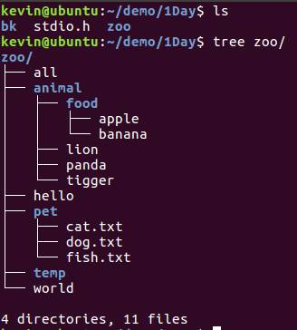

- 绝对路径

​       从根目录开始表示的路径，也就是从/开始，例如：/home/itcast

- 相对路径

  - 从当前所处的目录开始表示的路径。

  -  . 表示当前目录

  - .. 表示当前目录的上一级目录

- Linux中的命令提示符

  

  - itcast: 当前登录的用户

  -  @：英文at, 在的意思

  -  itcast-virtual-machine: 主机名
    -  主机名在/etc/hosts这个文件中

  -  ~/test/course/day1：当前工作目录, ~表示宿主目录（家目录或者主目录）

      可通过：echo ~或者echo $HOME查看当前用户的宿主目录

  - $:表示当前用户为普通用户, #表示当前用户为root用户


## 5      文件和目录操作相关的命令

### 5.1  tree命令

- 以树状形式查看指定目录内容，使用该命令需要安装软件tree

  sudo apt-get update    sudo apt-get install tree

- 命令使用方法
  - tree  --  树形结构显示当前目录下的文件信息
  - tree 目录  -- 树形结构显示指定目录下的文件信息                                                                  

> 说明：使用 tree 命令查看目录内容层次清晰，一目了然。
>
> tree 命令只能查看目录内容, 不能查看普通文件内容。

### 5.2   ls命令

- 查看指定目录下的文件信息

- 使用方法：

  - ls  --显示当前目录下文件信息

  - ls 目录或文件名  --显示指定目录下文件信息

- 相关参数

  - -a：列出当前目录下的所有文件

    - . 当前目录

    -  .. 当前目录的上一级目录

    -  隐藏文件, 以 . 开头的文件名, 如.bashrc

    -  普通文件

-  -R：递归方式列出所有目录中的内容

- -l：列出文件的详细信息，7部分内容

  

  - 文件类型 （第1个字符）

    - “-”： 普通文件

    - d ： 目录

    - l ： 符号链接，相当于windows中的快捷方式

    - s ：套接字

    - p ： 管道

    - b ： 块设备

    - c ： 字符设备

  - 用户的操作权限 （2 – 10个字符）

    - 文件所有者对文件的操作权限 （2,3,4个字符）

    - 文件所属组用户对文件的操作权限（5,6,7个字符）

    - 其他人对文件的操作权限（8,9,10个字符）

  - 硬链接计数:

    - 对于目录来说, 链接计数等于该目录下所有的目录总数(含. 和 ..), 但是不包含该目录的子目录下的目录文件数量, 执行ls -la命令可以进行查看.

    - 对于文件来说, 指的是该文件所有的硬链接文件数量

  - 文件所有者： itcast

  - 文件所属组： itcast

  - 文件大小： 36

    - 如果是目录: 只表示目录大小, 不包含目录中的内容, 目录大小为4k

    - 如果是文件：表示文件大小

  - 文件的创建日期或最后修改时间：10月 13 11:41

  - 文件名：test.log

- 参数之间可以结合使用：

  - ls -la : 列出当前目录下所有文件的相信信息, 包括隐藏文件 

  - ls -ltr: 列出当前目录下的文件, 按照时间逆向排序

- 文件所有者, 所属组, 其他人的概念

  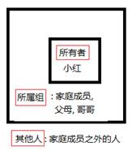

- 下图是 ls -l 命令截图

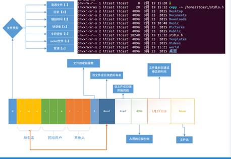

### 5.3  cd 命令

切换目录(change directory), 命令使用方式：cd + 路径

路径可以使用相对路径或者绝对路径

```scrpit
cd  /home/itcast   绝对路径(从根目录开始)
cd  ./itcast/test    相对路径(从当前工作目录开始)
```

- 切换到家目录（例如: /home/itcast）

```
cd
cd ~
cd /home/itcast
cd $HOME
```


- 临近两个目录直接切换

  - cd -

    如开始在：/home/itcast/test/course/day1/test 目录下, 执行了cd命令切换到家目录下, 然后在执行cd -又回到了 /home/itcast/test/course/day1/test 下。

### 5.4 pwd命令

查看用户当前所处的工作目录, printf working directory

### 5.5 which命令

显示命令所在的目录, 如which ls   which cp 

### 5.6 touch命令

如果文件不存在, 创建新文件, 如果文件存在, 更新文件的最后修改时间。

命令使用方式：touch 文件名

### 5.7 mkdir命令

创建新目录, make directory

创建方式：mkdir目录名

如果创建多级目录需要添加参数 -p

例：

- 在当前目录下创建目录:  mkdir mydir

- 在宿主目录下创建多级目录:  mkdir -p ~/test/hello/world/aa

### 5.8  rmdir命令

删除空目录，**只能删除空目录**，使用方式：rmdir 目录名

### 5.9  rm命令

- 删除文件： rm 文件名

- 删除目录： rm  -r 目录名

- 参数：

  - -r：递归删除目录，删除目录必须添加此参数

  - -i：提示用户是否删除文件或目录

  - -f：强制删除

> 注意事项：使用rm命令删除的文件或目录不会放入回收站中，数据不易恢复。

### 5.10 cp 命令

命令使用方式：cp 源目录或文件 目标目录或文件

若有目录的拷贝需要使用-r参数

- cp 要拷贝的文件（file1） file（不存在）
  - 创建file，将file1中的内容拷贝到file

- cp file1 file（存在）
  - file1覆盖file

- cp file dir（存在）
  - 拷贝file到dir目录

- cp -r dir（存在） dir1（存在）   

  - 将dir目录拷贝到dir1目录中

  - 包括dir目录

- cp -r dir（存在） dir1（不存在） 

  - 创建dir1

  - 将dir中的内容拷贝到dir1中, 不包括dir目录

- cp 拷贝目录也可以用-a参数, 这样可以保留被拷贝的文件的一些属性信息

### 5.11 mv命令

- 改名或者移动文件 mv file1 file2

  - 改名

    - mv file（存在） file1（不存在） 

    - mv dir（存在） dir1（不存在）

    - mv file（存在） file2（存在）
      - file文件覆盖file2文件,file改名为file2

    - 移动(第二个参数一定是目录文件)

      - mv file（文件） dir（存在目录）
        - 将file文件移动到dir中

      - mv dir（目录存在） dir1（目录存在）
        - 将dir移动到dir1中, dir就会作为dir1的子目录而存在

### 5.12 cat命令

- 将文件内容一次性输出到终端。
- 使用方式： cat 文件名
- 缺点：终端显示的内容有限，如果文件太长无法全部显示。
- 可用于文件重定向: cat file1>file2, 相当于cp file1 file2

### 5.13 more命令

- 文件内容分页显示到终端，但是只能一直向下浏览，不能回退。
- 使用方式：more + 文件名
- 相关操作：
  - 显示下一行：回车
  - 显示下一页：空格
  - 退出：q（ctrl + c）

### 5.14 less命令

- 文件内容分页显示到终端，可以自由上下浏览。
- 使用方式：less 文件名
- 相关操作：
  - 显示下一行：回车、ctrl + p、键盘向下键
  - 显示上一行：ctrl + n、键盘向上键
  - 显示下一页：空格、PageDown
  - 显示上一页：PageUp
  - 退出：q

### 5.15 head命令

- 从文件头部开始查看前n行的内容

- 使用方式：head -n[行数] 文件名
  - head -20 hello.txt
- 如果没有指定行数，默认显示前10行内容

### 5.16 tail命令

- 从文件尾部向上查看最后n行的内容

- 使用方式：tail -n[行数] 文件名

- 如果没有指定行数，默认显示最后10行内容

- 一个比较重要的应用：显示日志 : tail -f test.log

  一个终端tail -f test.log , 另一个终端: echo “hello world” >>test.log

### 5.17 软链接

- 软连接类似于windows下的快捷方式

- 如何创建软连接

  - ln -s 文件名 快捷方式的名字

    例如：ln -s aa aa.soft

  - 目录也可以创建软连接

    例如：ln -s tmp tmp.link

- 创建软链接应注意事项

  - ln创建软连接要用绝对路径，因为如果不使用绝对路径，一旦这个连接文件发生位置变动，就不能找到那个文件了。

  - 软连接文件的大小是: 路径+文件名的总字节数

### 5.18 硬链接

- ln 文件名 硬链接的名字 ln soucefile desfile

  - ln test.log test.log.hard

- 使用硬链接应注意事项

  - 硬链接不能建在目录上

  - 硬连接对绝对路径没有要求

  - 硬连接不能跨文件系统

    硬链接文件和源文件的inode是相同的，文件系统的inode要求唯一，跨文件系统可能会使inode不同, 所以硬链接不能跨文件系统

- 硬链接的本质

  - 硬连接的本质是不同的文件名所在的inode节点是相同的，相同的inode节点指向了相同的数据块，所以他们的文件内容是一样的，文件内容会同步。

    - ls -i 文件名 ------> 可以查看文件的i节点

    - stat 文件名 ------> 可以查看i节点信息

    - 如下图，file.hard 是 file 的硬链接, 这个两个文件指向了同一个inode, 同一个inode指向了相同的数据块(文件内容)。

      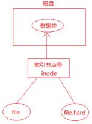

      - 当新创建了一个文件, 硬链接计数为1
      - 给文件创建了一个硬链接后, 硬链接计数加1
      - 删除一个硬链接后, 硬链接计数减1
      - 如果删除硬链接后, 硬链接计数为0, 则该文件会删除

- 硬链接应用场合
  - 可以起到同步文件的作用

    修改file的内容, 会在其余三个硬链接文件上同步。

  - 可以起到保护文件的作用

    删除文件的时候, 只要硬链接计数不为0, 不会真正删除, 起到保护文件的作用.

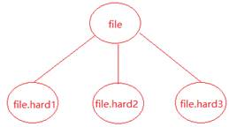

### 5.19  wc 

- 显示文件行数, 字节数, 单词数
  - wc -l file显示文件的总行数
  - wc -c file显示文件的总字节数
  - wc -w file显示文件的总单词数
  - wc file 显示文件的总行数, 单词数和总字节数

### 5.20  whoami

- whoami显示当前登陆的用户名

### 5.21 ps命令和kill命令

- ps aux | grep "xxx"

- ps ajx | grep "xxx"
  - -a：（all）当前系统所有用户的进程
  - -u：查看进程所有者及其他一些信息
  - -x：显示没有控制终端的进程 -- 不能与用户进行交互的进程【输入、输出】
  - -j: 列出与作业控制相关的信息

- kill -l 查看系统有哪些信号

- kill -9 pid 杀死某个线程


 

## 6      用户权限、用户、用户组

### 6.1 修改文件权限chmod

linux是通过权限对文件进行控制的, 通过使用chmod命令可以修改文件相关的权限.

- 文字设定法

  - 命令：chmod [who][+|-|=] [mode] 文件名

    - 操作对象【who】
      - u -- 用户（user）
      - g -- 同组用户（group）
      - o -- 其他用户（other）
      - a -- 所用用户（all）【默认】

    - 操作符【+-=】
      - “+--” 添加权限
      - “- --” 取消权限
      - “= --” 赋予给定权限并取消其他权限

    - 权限【mode】
      - r -- 读
      - w -- 写
      - x -- 执行

- 示例：给文件file.txt的所有者和所属组添加读写权限
  - chmod ug+wr file.txt

- **数字设定法**

  - 命令：chmod [+|-|=][mode] 文件名

    - 操作符【+-=】
      - ”+--“ 添加权限
      - “- --” 取消权限
      - “= --” 赋予给定权限并取消其他权限 (默认为=)

    - 数字表示的含义
      - 0 -- 没有权限(-)
      - 1 -- 执行权限（x）
      - 2 -- 写权限（w）
      - 4 -- 读权限（r)

- 例：给file.txt文件设置 rw-rw-r--
  - chmod 664 file.txt

> 注意点：使用数字设定法, 一定要使用 3 位的 8 进制数，如：066

### 6.2 修改文件所有者和所属组

- 修改文件所有者chown
  - 用法：chown 文件所有者 文件名
    - sudo chown mytest file.txt

- 修改文件所有者和所属组chown

- 用法：chown 文件所有者:文件所属组 文件名
  - sudo chown mytest:mytest file.txt
  - sudo chown mytest.mytest file.txt

> 注意：普通用户需要使用管理员用户权限执行该命令

> 注意：若系统没有其他用户, 可以使用sudo adduser 用户名 创建一个新用户。

### 6.3 修改文件所属组

- chgrp命令

  - 使用方法：chgrp 用户组 文件或目录名

    - 示例：修改文件所属组为mytest

      sudo chgrp mytest file.txt

- 普通用户需要使用管理员权限执行该命令。

## 7      find命令

- 按文件名查询：使用参数 -name
  - 命令：find  路径  -name   "文件名"
  - 示例：find /home -name "*.c"

- 按文件类型查询：使用参数 -type

  - 命令：find 路径 -type 类型
    - 类型         
      - 普通文件类型用f表示而不是 -
      - d -> 目录
      - l -> 符号链接
      - b -> 块设备文件
      - c -> 字符设备文件
      - s -> socket文件
      - p -> 管道文件

  - 查找指定目录下的普通文件： find 路径 -type f

- 按文件大小查询：使用参数 -size

  - 命令：find  路径  -size  范围

    - 范围
      - 大于：+表示 --  +100k
      - 小于：-表示  --  -100k
      - 等于: 不需要添加符号 --  100k

    - 大小
      - M 必须大写（10M）
      - k 必须小写（20k）
      - c 表示字节数

  - 例子: 查询目录为家目录
    - 等于100k 的文件:  find ~/ -size 100k
    - 大于100k 的文件:  find ~/ -size +100k
    - 大于50k, 小于 100k 的文件:  find ~/ -size +50k -size -100k

- 按文件日期

  - 创建日期：-ctime -n/+ n

    - -n: n天以内

    - +n: n天以外

      find . -ctime +20 -ctime -30 查找20天到30天创建的文件

  - 修改日期：-mtime -n/+n

  - 访问日期：-atime -n/+n

- 按深度

  - -maxdepth n(层数）

    - 搜索n层以下的目录, 搜索的层数不超过n层

      find . -maxdepth 3 查找当前目录下不超过3层的文件

  - -mindepth n（层数）
    - 搜搜n层以上的目录,搜索的层数不能小于n层

- 高级查找

  - 例：查找指定目录下所有目录，并列出目录中文件详细信息

    - find ./ -type d -exec shell命令 {} \;

      find ./ -type d -exec ls -l {} \;

    - find ./ -type d -ok shell命令 {} \;

      find ./ -type d -ok ls -l {} \;

      - 注意: {}中间不能有“空格”
      - ok比较安全, 特别是在执行rm删除文件的时候.

    - find ./ -type d | xargs shell命令

      find ./ -type d | xargs ls -l

## 8  grep命令

- grep -r（有目录） “查找的内容” 搜索的路径
  -  -r参数, 若是目录, 则可以递归搜索
  -  -n参数可以显示该查找内容所在的行号
  -  -i参数可以忽略大小写进行查找
  -  -v参数不显示含有某字符串

- 搜索当前目录下包含hello world字符串的文件
  - grep -r -n "hello world" ./         ------ 显示行号
  - grep -r -i -n "HELLO world" ./   ------ 忽略大小小查找

## 9      find和grep命令结合使用

- 先使用find命令查找文件, 然后使用grep命令查找哪些文件包含某个字符串
  - find . -name "*.c" | xargs grep -n "main"

## 10  Linux中常用的压缩工具

- gzip和bzip2
  - 不能压缩目录，只能一个一个文件进行压缩，压缩之后会使原文件消失
  - gzip *    压缩当前目录下所有的文件, 但是目录不能压缩
  - gunzip *  解压当前目录下所有的.gz文件
  - bzip2 *   压缩当前目录下所有的文件, 但是目录不能压缩
  - bunzip2 * 解压当前目录下所有的. bz2文件

- tar工具
  - 相关参数说明
    - z：用gzip来压缩/解压缩文件
    - j：用bzip2来压缩/解压缩文件
    - c：create, 创建新的压缩文件, 与x互斥使用
    - x：从压缩文件中释放文件, 与c互斥使用
    - v：详细报告tar处理的文件信息
    - f：指定压缩文件的名字
    - t:  查看压缩包中有哪些文件

  - 压缩：
    - tar cvf 压缩包名字.tar 原材料[要打包压缩的文件或目录]
    - tar zcvf 压缩包名字.tar.gz 原材料[要打包压缩的文件或目录]
    - tar jcvf 压缩包名字.tar.bz2 原材料[要打包压缩的文件或目录]
  - 解压缩：
    - tar  xvf   已有的压缩包（test.tar.gz）
    - tar  zxvf  已有的压缩包（test.tar.gz）
    - tar  jxvf  已有的压缩包（test.tar.bz2）
    - 解压到指定目录：添加参数 -C（大写）
      - tar zxvf test.tar.gz -C 解压目录（./mytest）
  - 查看压缩包中有哪些文件
    - tar -tvf test.tar

- rar工具
  - 使用前需要安装 rar 工具

    - sudo apt-get install rar

  - 压缩：

    - 命令： rar a -r 要压缩的文件(含文件或者目录)

    - 压缩目录需要使用参数：-r

      rar a -r my aa bb dir  ----将aa bb dir压缩到my.rar文件中

    - 打包的生成的新文件不需要指定后缀

  - 解压缩：

    - 命令：rar x xxx.rar 压缩目录

      - rar x my.rar  ----将my.rar解压到当前目录

    - 解压到指定目录, 直接指定解压目录即可

      - rar x xxx.rar目录

        rar x my.rar TAR  ----- 将 my.rar 解压到 TAR 目录下

​                             **注意：**若解压目录不存在则会报错

- zip工具
  - 压缩：zip -r 压缩包名 要压缩的文件(含文件或目录)

    - 压缩目录需要使用参数 -r

    - 使用该命令不需要指定压缩包后缀

      zip -r xxx file dir ---生成xxx.zip文件

  - 解压缩：unzip压缩包名

    - 解压缩到指定目录：添加参数 –d 解压目录

      unzip xxx.zip -d /home/itcast/test/day1

    **注意：**解压目录若不存在则会创建．

## 11  软件的安装和卸载

### 11.1 在线安装

- 软件安装：sudo apt-get install 软件名
- 软件卸载：sudo apt-get remove 软件名
- 更新软件列表：sudo apt-get update
- 清理安装包：sudo apt-get clean
  - 清理的是缓存路径：/var/cache/apt/archives

### 11.2 软件包安装

- 在Ubuntu系统下必须有deb格式的安装包
- 软件安装
  - sudo dpkg -i xxx.deb
- 软件卸载
  - sudo dpkg -r  软件名

 

## 12作业练习:

1. 说出Linux下的目录结构

2. 写出下列目录的作用:

   - /dev

   - /etc

   - /home

   - /usr

   - /bin

   - /lib

   - /mnt

3. itcast@itcast:~/SoftWare/QQ$, 从该字符串中提炼出你所知道的信息。

4. 通过ls -l 命令得到以下文件的详细信息，请写出各个部分代表的意思？


5. 创建 test 目录，在里面创建 aa bb cc 三个目录，在 aa 里创建 hello 文件，在bb里创建 world 目录，在 cc 里创建 itcast.c，然后执行 tree 和 ls -R，最后删除 test。

   要求所有的操作都在同一级目录中完成。

6. 如图：

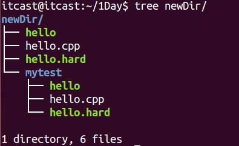

   使用 rm 命令删除 newDir 中所有的内容, 使其成为一个空目录。


7. 在指定目录下内容如图所示:

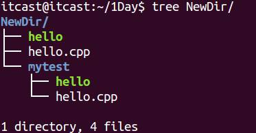

   将 NewDir 目录中的内容拷贝到另一个已经存在的空目录(file)中, 效果如图:

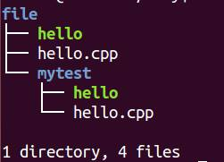

8. 如何给文件创建软连接(举例), 有什么注意事项?

9. 现有一个文件hello.txt, 文件访问权限为 rwxrw-rw-

   - 使用文字设定法将文件所属组和其他人添加执行权限 x

   - 使用数字设定法去掉文件所有者的读写权限

10. 写出命令查找宿主目录下文件大于100k小于10M的文件，并将查到文件的详细信息保存到另一个文件file中。

```
find ~ -size +100k -size -10M | xargs ls -l > file
```

11. 写出命令查找宿主目录下文件中含有 "hello, world" 字符串的文件，并显示行号。

12. 写出命令卸载 Linux 中的 tree 软件(两种方式)

13. 当前目录下有 a, b, c 三个文件和一个目录Dir

    - 分别使用 tar, rar, zip 命令将三个文件和目录压缩为一个文件.

    - 将压缩好的文件解压缩到 /home/itheima 目录中